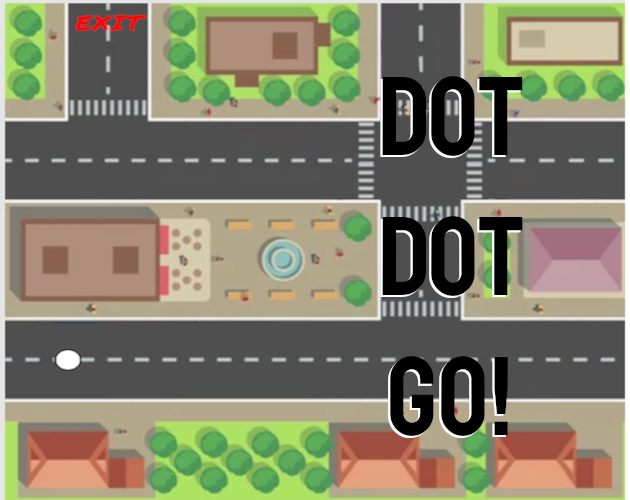

# Dot Dot Go

### An experiment in using machine learning and voice recognition as an alternative controller. 

Direct your dot to the exit by saying "UP", "DOWN", "LEFT", and "RIGHT" using your mouth and voice!
Press R to Reset

If you find the ball behaves weirdly, or doesn't respond to you, it's because the algorithm that recognises speech is trained to my voice, so try your best to sound like me.